# Project Title

Welcome to the Period Tracker project! This is a simple application designed to help users track their menstrual cycles. It allows users to record important information about their periods, such as start and end dates and symptoms.

## Features

- Track menstrual cycles: Users can record the start and end dates of their periods, and the application will calculate the duration of each cycle.
- Symptom tracking: Users can log any symptoms they experience during their menstrual cycle, such as cramps, mood swings, or fatigue.

## UI Components include

1. Bottom Navigation Bar
3. Snack Bar
4. Various Calendar Widgets
5. Buttons
6. Labels
7. Text Fields
8. Progress Indicator
9. Pop up
10. Splash Screen

## Usage
To use the Period Tracker app, follow these steps:

1. Sign up for a new account:
- Click on the "Sign Up" button.
- Fill in the required information, including your name, email     address, phone number and other details
- Once completed, click "Sign Up" to create your account.

2. Verification:
- OTP will be sent on the number which is enter by the user to verify
- Once the user is verified, you land on the on-boarding page which guides the user about different features of the app

3. Log in to your account:
- If you already have an account, click on the "Log In" button.
- Enter the required credentials for logging in

4. Home Page:
- Once logged in, you will be directed to the home page.
- Here, you can view a summary of your menstrual cycles, including the current cycle, previous cycle, and upcoming cycle predictions.

4. Add a Period log:
- You can add various symptoms that you face during the menstrual cycle
- Click "Save" to record the period log.
- You can also edit the log by clicking on the "Edit dates button"

5. View and edit recorded menstrual cycles:
- To view and edit your recorded menstrual cycles, click on the "History" option in the navigation menu.
- The cycles will be listed in chronological order, with the most recent cycle displayed first.
- To edit a cycle, click on the "Edit" button next to the respective cycle.
- You can update the start and end dates, symptoms, or notes.
- Click "Save" to apply the changes.

6. Account settings:
- To access your account settings, click on the "My profile" option in the navigation menu.
- In the account settings, you can update your name, period start date, flow days, etc.
- Click "Save" to save the changes.

7. Stories:
- There is a stories section in the bottom navigation bar where you can read articles related to menstrual cycle

## Screenshots of the UI
<table>
<tr>
  <td>Splash Screen</td>
  <td>Onborading page</td>
  <td>Signup Page</td>
  <td>Login Page</td>
  </tr>
  <tr>
    <td></td>
    <td>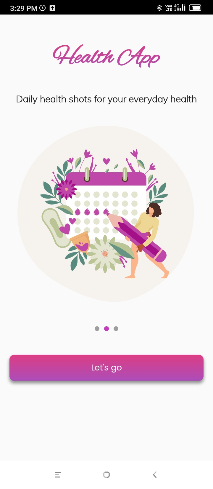</td>
    <td>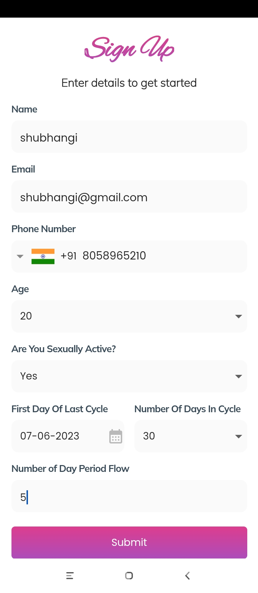</td>
    <td>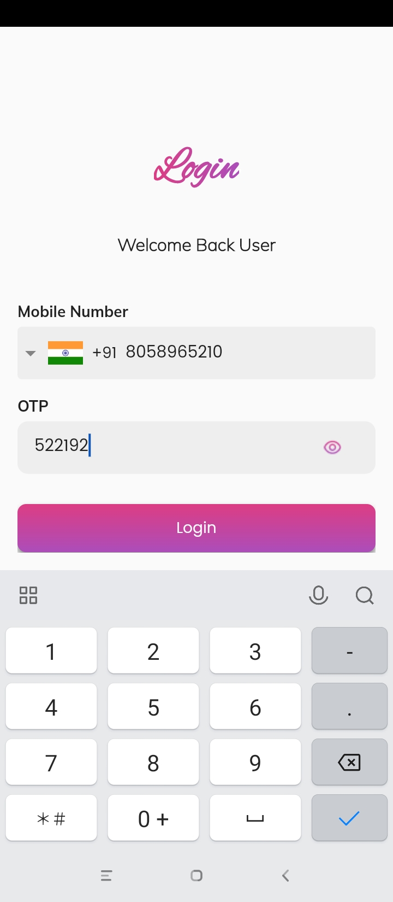</td>
  </tr>
<tr>
  <td>Verification Page</td>
  <td>Home Page (ongoing menstrual cycle)</td>
  <td>Home Page (ongoing fertile window)</td>
  <td>Side menu</td>
  </tr>
  <tr>
    <td>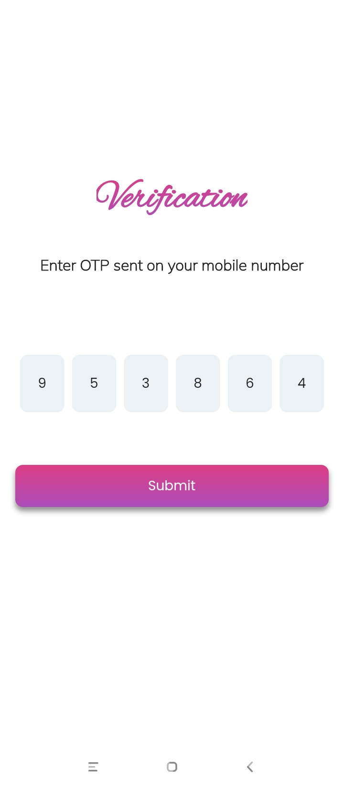</td>
    <td>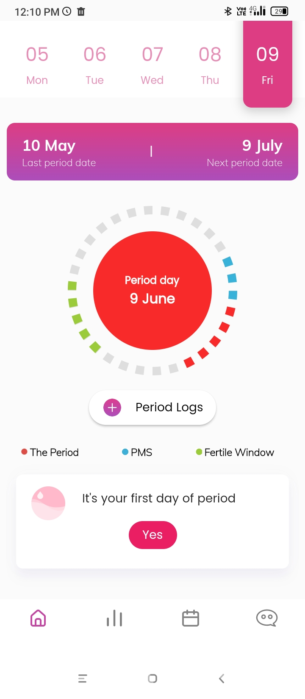</td>
    <td>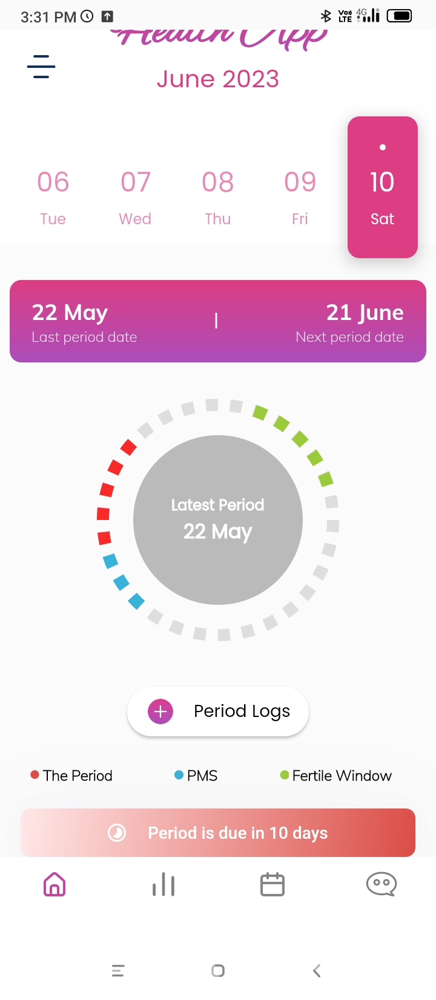</td>
    <td>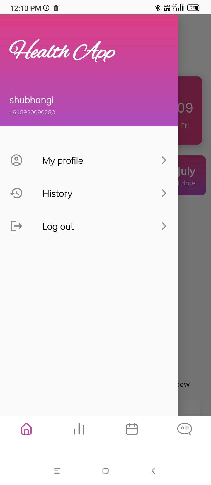</td>
  </tr>
<tr>
  <td>Stories page</td>
  <td>Calendar Page</td>
  <td>Period logs</td>
  <td>Period logs</td>
  </tr>
  <tr>
    <td></td>
    <td>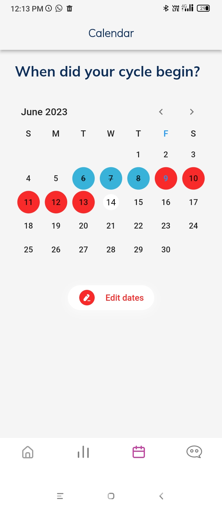</td>
    <td>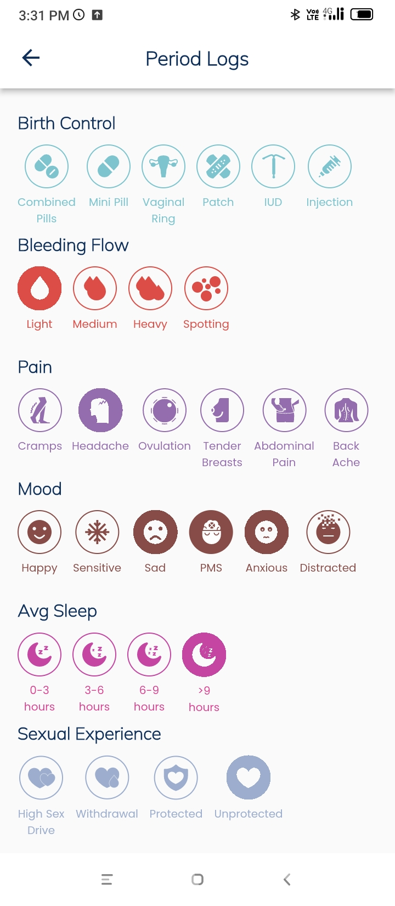</td> 
    <td>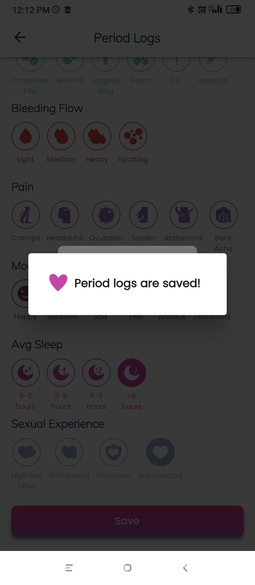</td>
  </tr>
<tr>
  <td>History Page</td>
  <td>Downloaded PDF</td>
  <td>Logout popup</td>
  </tr>
  <tr>
    <td>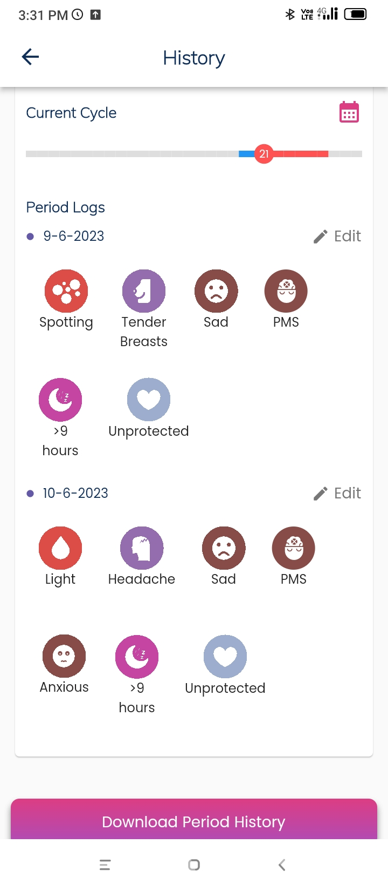</td> 
    <td>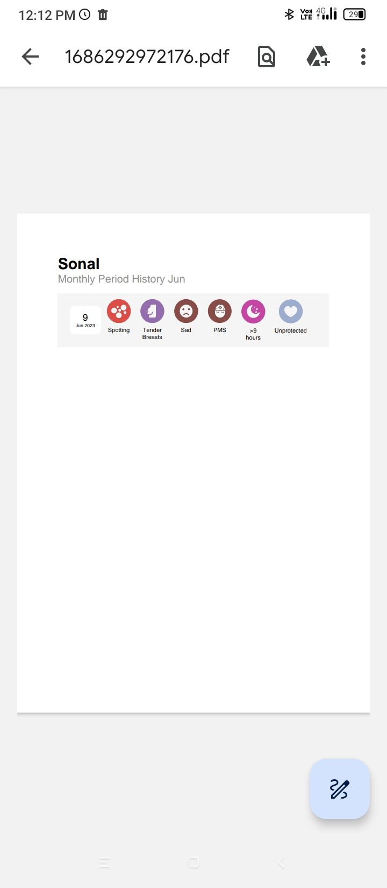</td> 
    <td>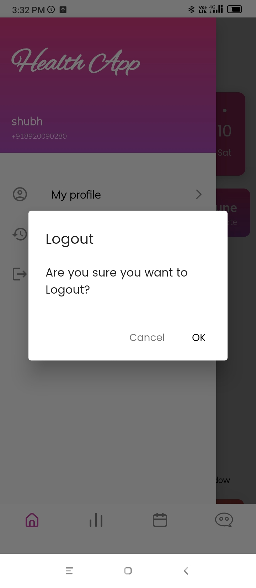</td> 
  </tr>

  </table>