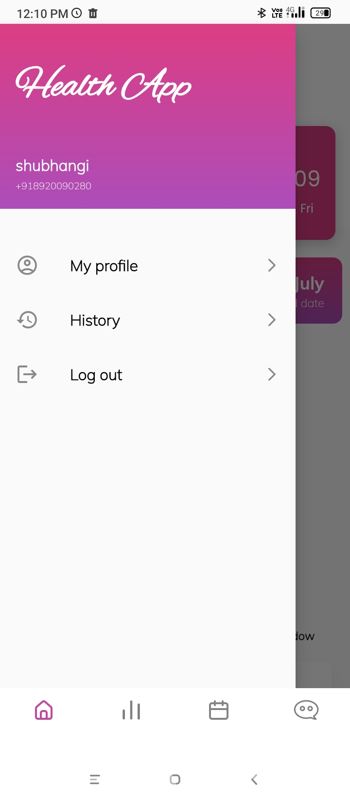
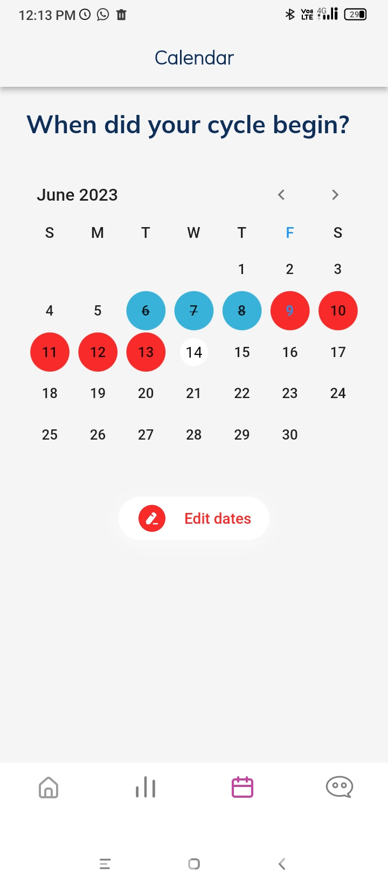
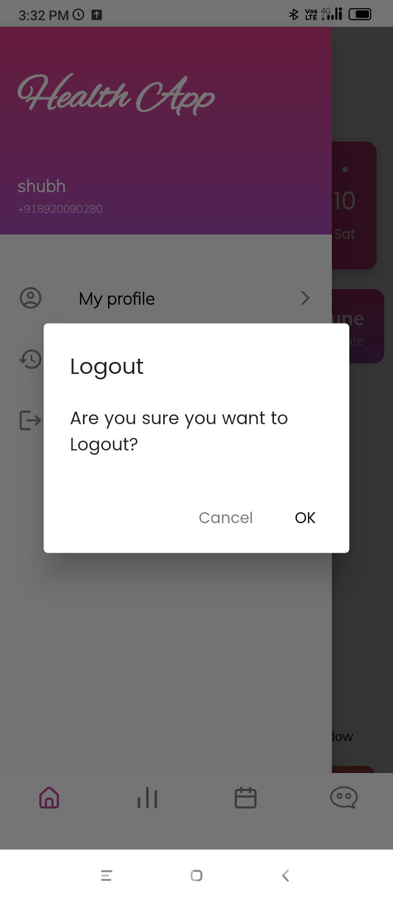

<h1 align=center> Flutter UI Components (Screen Shots) </h1>
<h3 align=center> Amazing UI Components for you to choose from. 📜 </h3>
 
<table>
<tr>
  <td>Splash Screen</td>
  <td>Onborading page</td>
  <td>Signup Page</td>
  <td>Login Page</td>
  </tr>
  <tr>
    <td></td>
    <td></td>
    <td></td>
    <td></td>
  </tr>
<tr>
  <td>Verification Page</td>
  <td>Home Page (ongoing menstrual cycle)</td>
  <td>Home Page (ongoing fertile window)</td>
  <td>Side menu</td>
  </tr>
  <tr>
    <td></td>
    <td></td>
    <td></td>
    <td></td>
  </tr>
<tr>
  <td>Stories page</td>
  <td>Calendar Page</td>
  <td>Period logs</td>
  <td>Period logs</td>
  </tr>
  <tr>
    <td></td>
    <td></td>
    <td></td> 
    <td></td>
  </tr>
<tr>
  <td>History Page</td>
  <td>Downloaded PDF</td>
  <td>Logout popup</td>
  </tr>
  <tr>
    <td></td> 
    <td></td> 
    <td></td> 
  </tr>

  </table>