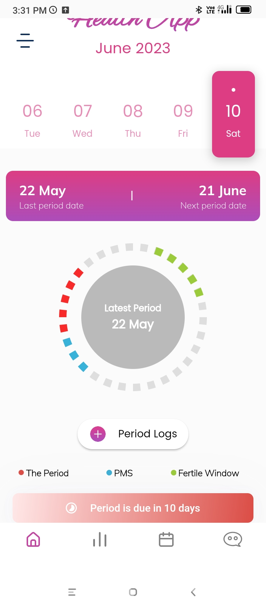
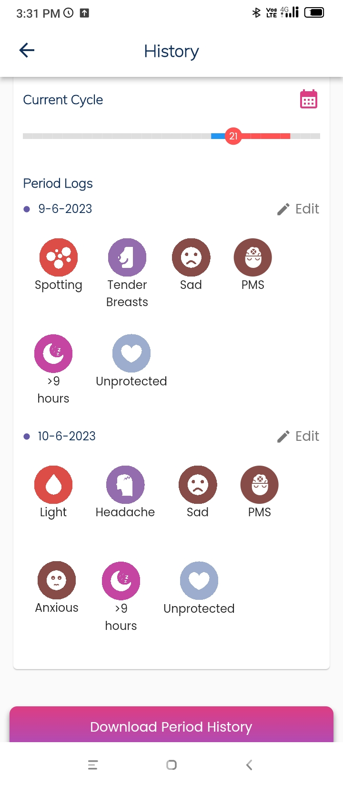

<h1 align=center> Flutter UI Components (Screen Shots) </h1>
<h3 align=center> Amazing UI Components for you to choose from. 📜 </h3>
 
<table>
<tr style="width=450 height=600">
  <td><b>Splash Screen</b></td>
  <td><b>Onborading page</b></td>
  <td><b>Signup Page</b></td>
  <td><b>Login Page</b></td>
  </tr>
  <tr style="width=450 height=600">
    <td><b></b></td>
    <td><b></b></td>
    <td><b></b></td>
    <td><b></b></td>
  </tr>
<tr style="width=450 height=600">
  <td><b>Verification Page</b></td>
  <td><b>Home Page (ongoing menstrual cycle)</b></td>
  <td><b>Home Page (ongoing fertile window)</b></td>
  <td><b>Side menu</b></td>
  </tr>
  <tr style="width=450 height=600">
    <td><b></b></td>
    <td><b></b></td>
    <td><b></b></td>
    <td><b></b></td>
  </tr>
<tr style="width=450 height=600">
  <td><b>Stories page</b></td>
  <td><b>Calendar Page</b></td>
  <td><b>Period logs</b></td>
  <td><b>Period logs</b></td>
  </tr>
  <tr style="width=450 height=600">
    <td><b></b></td>
    <td><b></b></td>
    <td><b></b></td> 
    <td><b></b></td>
  </tr>
<tr style="width=450 height=600">
  <td><b>History Page</b></td>
  <td><b>Downloaded PDF</b></td>
  <td><b>Logout popup</b></td>
  </tr>
  <tr style="width=450 height=600">
    <td><b></b></td> 
    <td><b></b></td> 
    <td><b></b></td> 
  </tr>

  </table>